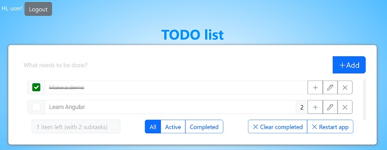

Initial Set Up:

- Run all services via docker-compose
- Open the Keycloak Administration Console: http://127.0.0.1:3300/admin/
- Log in using credentials from the docker-compose file:
    - ```KEYCLOAK_ADMIN: root```
    - ```KEYCLOAK_ADMIN_PASSWORD: sudo```
- Select the my-to-do realm
- Create a new user, set a password for them
- Open the UI: http://localhost:3002/
- Log in using credentials from the previous step
- Enjoy the app! :)


